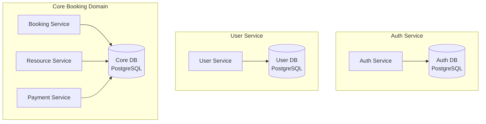
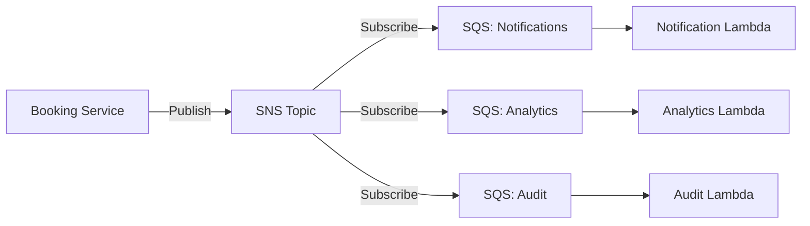
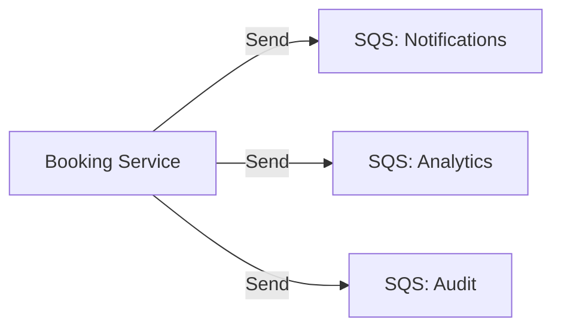
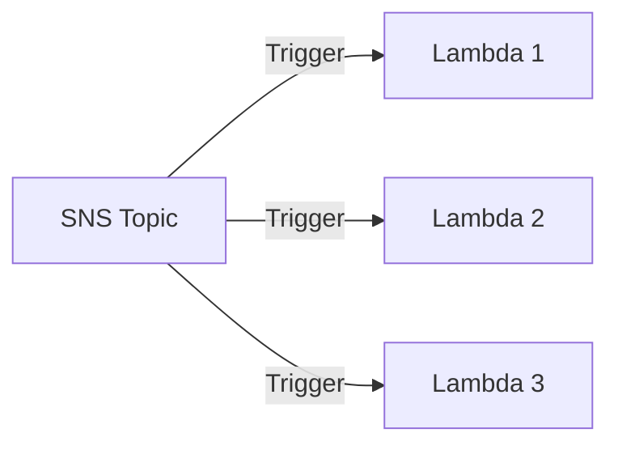
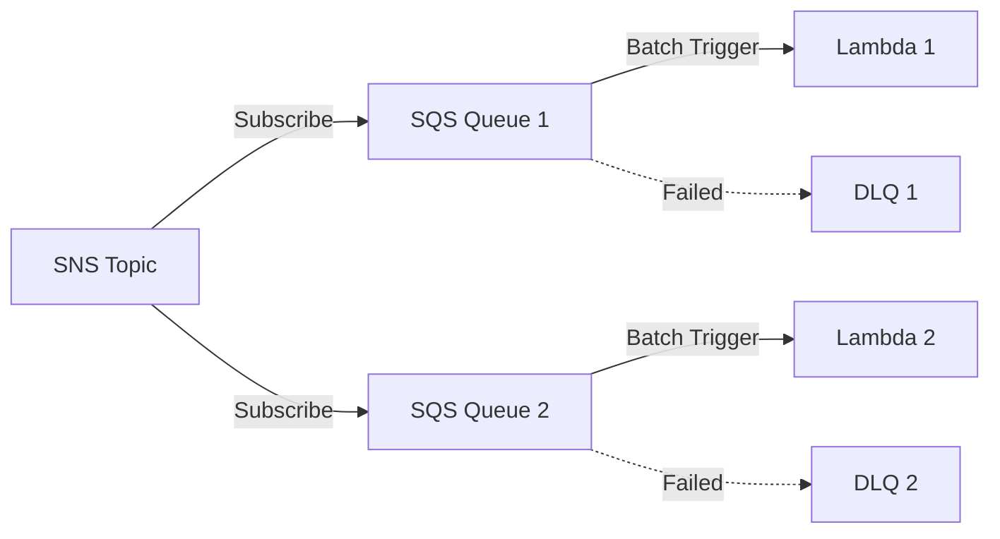
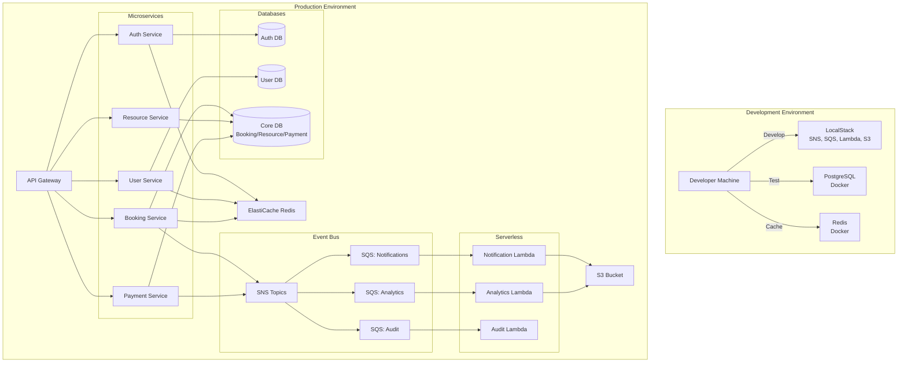

# 🤔 Architecture Q&A - Resource Booking Platform

## Question 1: Why Centralized Database Instead of Database per Service?

### Current Approach: Shared PostgreSQL Database
The current architecture uses a **single PostgreSQL RDS instance** with separate schemas/tables for each service.

### Why This Approach?

#### ✅ Advantages of Shared Database (Current)
1. **ACID Transactions Across Entities**
   - Booking creation requires atomic operations across `bookings`, `resource_availability`, and `booking_events`
   - Ensures data consistency without distributed transactions
   - Simpler rollback mechanisms

2. **Referential Integrity**
   - Foreign key constraints between `bookings` and `resources`
   - Database-level enforcement of data integrity
   - Prevents orphaned records

3. **Simpler Queries**
   - JOIN operations for complex queries (e.g., bookings with resource details)
   - No need for data aggregation across services
   - Better performance for reporting

4. **Lower Operational Complexity**
   - Single database to manage, backup, and monitor
   - Reduced infrastructure costs
   - Easier disaster recovery

5. **Development Speed**
   - Faster initial development
   - Simpler testing (single database to seed)
   - Lower learning curve for team

#### ❌ Disadvantages of Shared Database
1. **Tight Coupling**: Services share database schema
2. **Scaling Limitations**: Cannot scale databases independently
3. **Single Point of Failure**: Database outage affects all services
4. **Schema Migration Complexity**: Changes require coordination

---

### Alternative: Database per Service (Microservices Pattern)

#### ✅ Advantages of Database per Service
1. **Service Autonomy**: Each service owns its data
2. **Independent Scaling**: Scale databases based on service needs
3. **Technology Flexibility**: Use different databases (PostgreSQL, MongoDB, DynamoDB)
4. **Fault Isolation**: Database failure affects only one service
5. **Independent Deployment**: Schema changes don't require coordination

#### ❌ Disadvantages of Database per Service
1. **Distributed Transactions**: Need Saga pattern or 2PC
2. **Data Duplication**: Must replicate data across services
3. **Complex Queries**: No JOINs across services
4. **Eventual Consistency**: Data may be temporarily inconsistent
5. **Higher Costs**: Multiple database instances

---

### 🎯 Recommended Hybrid Approach

For this booking platform, I recommend a **hybrid approach**:

#### Phase 1: Shared Database (Current - MVP)
- Start with shared PostgreSQL for faster development
- Use separate schemas per service for logical separation
- Implement clear service boundaries in code

#### Phase 2: Gradual Migration (Production)
- Extract **Auth Service** to separate database (low coupling)
- Extract **User Service** to separate database
- Keep **Booking, Resource, Payment** in shared database (high coupling)

#### Final Architecture



#### Why Keep Core Domain Together?
1. **Strong Consistency Requirements**: Bookings must be atomic with resource availability
2. **Frequent Cross-Entity Queries**: Bookings always need resource details
3. **Transaction Boundaries**: Payment and booking status must be consistent
4. **Performance**: Avoid network calls for every booking operation

#### Implementation Strategy
```sql
-- Separate schemas in shared database
CREATE SCHEMA auth;
CREATE SCHEMA users;
CREATE SCHEMA bookings;
CREATE SCHEMA resources;
CREATE SCHEMA payments;

-- Each service only accesses its schema
-- Use database roles to enforce access control
GRANT ALL ON SCHEMA bookings TO booking_service_role;
GRANT SELECT ON SCHEMA resources TO booking_service_role;
```

---

## Question 2: Why SNS + SQS Together?

### The Pattern: SNS Fan-Out to SQS



### Why Not Just SQS?

#### ❌ Problem with Direct SQS


**Issues**:
1. **Tight Coupling**: Booking service must know all consumers
2. **Code Changes**: Adding new consumer requires modifying producer
3. **Multiple API Calls**: 3 SQS sends = 3x latency and cost
4. **Failure Handling**: If one send fails, others may succeed (inconsistent)

### Why SNS + SQS?

#### ✅ Advantages

1. **Decoupling (Pub/Sub Pattern)**
   - Producer publishes once to SNS
   - Consumers subscribe independently
   - Add/remove consumers without changing producer

2. **Fan-Out**
   - Single publish reaches multiple subscribers
   - Guaranteed delivery to all subscribers
   - Atomic operation (all or nothing)

3. **Message Filtering**
   ```json
   {
     "FilterPolicy": {
       "eventType": ["BookingCreated", "BookingConfirmed"]
     }
   }
   ```
   - Each SQS queue can filter events
   - Reduces unnecessary processing
   - Lower Lambda invocations = lower cost

4. **Durability + Buffering**
   - SNS provides pub/sub
   - SQS provides buffering and retry logic
   - Best of both worlds

5. **Lambda Integration**
   - SQS triggers Lambda with batching
   - Built-in retry and DLQ
   - Better error handling than SNS direct

6. **Independent Scaling**
   - Each consumer scales independently
   - Slow consumer doesn't affect others
   - SQS acts as buffer

#### Example: Adding New Consumer

**Without SNS** (Direct SQS):
```java
// Booking Service - Must modify code
public void publishBookingEvent(BookingEvent event) {
    sqsClient.sendMessage(notificationQueue, event);
    sqsClient.sendMessage(analyticsQueue, event);
    sqsClient.sendMessage(auditQueue, event);
    sqsClient.sendMessage(newConsumerQueue, event); // NEW CODE
}
```

**With SNS** (Pub/Sub):
```java
// Booking Service - No code changes needed
public void publishBookingEvent(BookingEvent event) {
    snsClient.publish(bookingTopic, event);
}

// New consumer just subscribes to SNS topic
// No changes to producer code!
```

### Alternative: Just SNS?

#### ❌ Why Not SNS Direct to Lambda?


**Problems**:
1. **No Retry Control**: SNS retries are limited (3 attempts)
2. **No Batching**: Each message triggers Lambda separately (expensive)
3. **No DLQ per Consumer**: Single DLQ for all failures
4. **Throttling Issues**: Lambda concurrency limits affect all consumers
5. **No Visibility Timeout**: Can't extend processing time

#### ✅ SNS + SQS + Lambda (Recommended)


**Benefits**:
1. **Configurable Retries**: Up to 1000 retries per queue
2. **Batching**: Process up to 10 messages per Lambda invocation
3. **Independent DLQs**: Separate failure handling per consumer
4. **Visibility Timeout**: Extend processing time dynamically
5. **Cost Optimization**: Fewer Lambda invocations

### Cost Comparison

**Scenario**: 1 million booking events/month, 3 consumers

| Approach | SNS Publishes | SQS Sends | Lambda Invocations | Monthly Cost |
|----------|---------------|-----------|-------------------|--------------|
| Direct SQS | 0 | 3M | 3M | ~$1,200 |
| SNS Direct | 1M | 0 | 3M | ~$1,200 |
| SNS + SQS (batch=10) | 1M | 3M | 300K | ~$150 |

**SNS + SQS with batching = 87.5% cost reduction!**

---

## Question 3: LocalStack for Local AWS Resources

### What is LocalStack?

LocalStack is a **fully functional local AWS cloud stack** that emulates AWS services on your local machine.

### ✅ Yes, Absolutely Possible!

#### Supported Services for This Project
- ✅ **API Gateway**: REST APIs
- ✅ **Lambda**: Function execution
- ✅ **SNS**: Topics and subscriptions
- ✅ **SQS**: Queues and DLQs
- ✅ **S3**: Bucket storage
- ✅ **RDS**: PostgreSQL (via Docker)
- ✅ **ElastiCache**: Redis (via Docker)
- ✅ **CloudWatch**: Logs (basic)
- ✅ **IAM**: Roles and policies
- ⚠️ **X-Ray**: Limited support
- ⚠️ **Cognito**: Limited support

---

### LocalStack Setup

#### 1. Docker Compose Configuration

```yaml
# docker-compose.localstack.yml
version: '3.8'

services:
  localstack:
    image: localstack/localstack:latest
    ports:
      - "4566:4566"            # LocalStack Gateway
      - "4510-4559:4510-4559"  # External services
    environment:
      - SERVICES=apigateway,lambda,sns,sqs,s3,cloudwatch,iam
      - DEBUG=1
      - DATA_DIR=/tmp/localstack/data
      - LAMBDA_EXECUTOR=docker
      - DOCKER_HOST=unix:///var/run/docker.sock
    volumes:
      - "./localstack-data:/tmp/localstack"
      - "/var/run/docker.sock:/var/run/docker.sock"
      - "./aws-resources:/etc/localstack/init/ready.d"

  postgres:
    image: postgres:15-alpine
    ports:
      - "5432:5432"
    environment:
      - POSTGRES_DB=booking_platform
      - POSTGRES_USER=booking_user
      - POSTGRES_PASSWORD=booking_pass
    volumes:
      - postgres-data:/var/lib/postgresql/data
      - "./init-scripts:/docker-entrypoint-initdb.d"

  redis:
    image: redis:7-alpine
    ports:
      - "6379:6379"
    volumes:
      - redis-data:/data

volumes:
  postgres-data:
  redis-data:
```

#### 2. Infrastructure as Code (Terraform)

```hcl
# terraform/localstack/main.tf
terraform {
  required_providers {
    aws = {
      source  = "hashicorp/aws"
      version = "~> 5.0"
    }
  }
}

provider "aws" {
  region                      = "us-east-1"
  access_key                  = "test"
  secret_key                  = "test"
  skip_credentials_validation = true
  skip_metadata_api_check     = true
  skip_requesting_account_id  = true

  endpoints {
    apigateway     = "http://localhost:4566"
    lambda         = "http://localhost:4566"
    sns            = "http://localhost:4566"
    sqs            = "http://localhost:4566"
    s3             = "http://localhost:4566"
    cloudwatch     = "http://localhost:4566"
    iam            = "http://localhost:4566"
  }
}

# SNS Topics
resource "aws_sns_topic" "booking_events" {
  name = "booking-events-topic"
}

resource "aws_sns_topic" "payment_events" {
  name = "payment-events-topic"
}

# SQS Queues
resource "aws_sqs_queue" "notification_dlq" {
  name = "notification-dlq"
}

resource "aws_sqs_queue" "notification_queue" {
  name                       = "notification-queue"
  visibility_timeout_seconds = 30
  message_retention_seconds  = 345600
  redrive_policy = jsonencode({
    deadLetterTargetArn = aws_sqs_queue.notification_dlq.arn
    maxReceiveCount     = 3
  })
}

# SNS to SQS Subscription
resource "aws_sns_topic_subscription" "booking_to_notification" {
  topic_arn = aws_sns_topic.booking_events.arn
  protocol  = "sqs"
  endpoint  = aws_sqs_queue.notification_queue.arn
}

# S3 Bucket
resource "aws_s3_bucket" "reports" {
  bucket = "booking-reports"
}

# Lambda Function
resource "aws_lambda_function" "notification" {
  filename      = "lambda/notification.zip"
  function_name = "notification-handler"
  role          = aws_iam_role.lambda_role.arn
  handler       = "index.handler"
  runtime       = "nodejs18.x"
  timeout       = 30
  memory_size   = 512

  environment {
    variables = {
      SQS_QUEUE_URL = aws_sqs_queue.notification_queue.url
    }
  }
}

# Lambda Event Source Mapping
resource "aws_lambda_event_source_mapping" "notification_trigger" {
  event_source_arn = aws_sqs_queue.notification_queue.arn
  function_name    = aws_lambda_function.notification.arn
  batch_size       = 10
}
```

#### 3. Application Configuration

```yaml
# application-local.yml
spring:
  datasource:
    url: jdbc:postgresql://localhost:5432/booking_platform
    username: booking_user
    password: booking_pass
  
  data:
    redis:
      host: localhost
      port: 6379

aws:
  region: us-east-1
  endpoint: http://localhost:4566  # LocalStack endpoint
  credentials:
    access-key: test
    secret-key: test
  
  sns:
    booking-topic: arn:aws:sns:us-east-1:000000000000:booking-events-topic
    payment-topic: arn:aws:sns:us-east-1:000000000000:payment-events-topic
  
  sqs:
    notification-queue: http://localhost:4566/000000000000/notification-queue
```

#### 4. AWS SDK Configuration

```java
// config/AwsConfig.java
@Configuration
@Profile("local")
public class LocalAwsConfig {
    
    @Bean
    public SnsClient snsClient() {
        return SnsClient.builder()
            .region(Region.US_EAST_1)
            .endpointOverride(URI.create("http://localhost:4566"))
            .credentialsProvider(StaticCredentialsProvider.create(
                AwsBasicCredentials.create("test", "test")
            ))
            .build();
    }
    
    @Bean
    public SqsClient sqsClient() {
        return SqsClient.builder()
            .region(Region.US_EAST_1)
            .endpointOverride(URI.create("http://localhost:4566"))
            .credentialsProvider(StaticCredentialsProvider.create(
                AwsBasicCredentials.create("test", "test")
            ))
            .build();
    }
    
    @Bean
    public S3Client s3Client() {
        return S3Client.builder()
            .region(Region.US_EAST_1)
            .endpointOverride(URI.create("http://localhost:4566"))
            .credentialsProvider(StaticCredentialsProvider.create(
                AwsBasicCredentials.create("test", "test")
            ))
            .forcePathStyle(true)  // Required for LocalStack
            .build();
    }
}
```

---

### Development Workflow

#### 1. Start LocalStack
```bash
# Start all services
docker-compose -f docker-compose.localstack.yml up -d

# Check services are running
docker-compose ps

# View logs
docker-compose logs -f localstack
```

#### 2. Initialize Infrastructure
```bash
# Using Terraform
cd terraform/localstack
terraform init
terraform apply -auto-approve

# Or using AWS CLI
aws --endpoint-url=http://localhost:4566 sns create-topic --name booking-events-topic
aws --endpoint-url=http://localhost:4566 sqs create-queue --queue-name notification-queue
```

#### 3. Run Spring Boot Services
```bash
# Run with local profile
./mvnw spring-boot:run -Dspring-boot.run.profiles=local

# Or with environment variable
export SPRING_PROFILES_ACTIVE=local
java -jar booking-service.jar
```

#### 4. Deploy Lambda Functions
```bash
# Package Lambda
cd lambda/notification
npm install
zip -r notification.zip .

# Deploy to LocalStack
aws --endpoint-url=http://localhost:4566 lambda create-function \
  --function-name notification-handler \
  --runtime nodejs18.x \
  --role arn:aws:iam::000000000000:role/lambda-role \
  --handler index.handler \
  --zip-file fileb://notification.zip
```

#### 5. Test Event Flow
```bash
# Publish to SNS
aws --endpoint-url=http://localhost:4566 sns publish \
  --topic-arn arn:aws:sns:us-east-1:000000000000:booking-events-topic \
  --message '{"eventType":"BookingCreated","bookingId":"123"}'

# Check SQS messages
aws --endpoint-url=http://localhost:4566 sqs receive-message \
  --queue-url http://localhost:4566/000000000000/notification-queue

# View Lambda logs
aws --endpoint-url=http://localhost:4566 logs tail /aws/lambda/notification-handler
```

---

### LocalStack Pro Features (Optional)

LocalStack offers a **Pro version** with additional features:

| Feature | Community | Pro |
|---------|-----------|-----|
| API Gateway | ✅ Basic | ✅ Advanced (WebSocket, Custom Domains) |
| Lambda | ✅ Basic | ✅ Layers, Container Images |
| RDS | ❌ | ✅ Full RDS emulation |
| ElastiCache | ❌ | ✅ Full Redis/Memcached |
| X-Ray | ❌ | ✅ Tracing |
| Cognito | ❌ | ✅ Full auth flows |
| CloudFormation | ✅ Basic | ✅ Advanced |

**Cost**: $30-50/month per developer

**Recommendation**: Start with Community, upgrade if needed

---

### Testing Strategy with LocalStack

#### 1. Unit Tests (No LocalStack)
```java
@Test
void testBookingCreation() {
    // Mock AWS services
    when(snsClient.publish(any())).thenReturn(publishResponse);
    
    Booking booking = bookingService.createBooking(request);
    
    assertNotNull(booking.getId());
    verify(snsClient).publish(any());
}
```

#### 2. Integration Tests (With LocalStack)
```java
@SpringBootTest
@Testcontainers
@ActiveProfiles("test")
class BookingServiceIntegrationTest {
    
    @Container
    static LocalStackContainer localstack = new LocalStackContainer(
        DockerImageName.parse("localstack/localstack:latest")
    ).withServices(Service.SNS, Service.SQS);
    
    @Test
    void testBookingEventFlow() {
        // Create booking
        Booking booking = bookingService.createBooking(request);
        
        // Verify SNS message published
        await().atMost(5, SECONDS).until(() -> {
            List<Message> messages = sqsClient.receiveMessage(queueUrl).messages();
            return !messages.isEmpty();
        });
    }
}
```

#### 3. End-to-End Tests
```bash
# Start LocalStack
docker-compose up -d

# Run E2E tests
./mvnw verify -P e2e-tests

# Cleanup
docker-compose down
```

---

### Benefits of LocalStack

#### ✅ Advantages
1. **Cost Savings**: No AWS charges during development
2. **Faster Development**: No network latency to AWS
3. **Offline Development**: Work without internet
4. **Reproducible**: Same environment for all developers
5. **CI/CD Integration**: Run tests in pipeline
6. **Rapid Iteration**: Instant infrastructure changes
7. **Safe Experimentation**: No risk to production

#### ⚠️ Limitations
1. **Not 100% AWS Compatible**: Some edge cases differ
2. **Performance Differences**: LocalStack may be slower/faster
3. **Limited Services**: Not all AWS services supported
4. **Maintenance**: Keep LocalStack version updated
5. **Resource Constraints**: Limited by local machine

---

### Recommended Setup

```
booking-platform/
├── docker-compose.yml              # Production-like local setup
├── docker-compose.localstack.yml   # LocalStack setup
├── terraform/
│   ├── aws/                        # Real AWS infrastructure
│   └── localstack/                 # LocalStack infrastructure
├── scripts/
│   ├── setup-local.sh              # Initialize LocalStack
│   ├── deploy-lambdas.sh           # Deploy to LocalStack
│   └── test-event-flow.sh          # Test SNS/SQS flow
└── src/
    └── main/resources/
        ├── application.yml         # Default config
        ├── application-local.yml   # LocalStack config
        └── application-prod.yml    # AWS config
```

---

## Summary of Recommendations

### 1. Database Strategy
- **Start**: Shared PostgreSQL with separate schemas
- **Evolve**: Extract Auth/User to separate databases
- **Keep**: Core domain (Booking/Resource/Payment) together

### 2. Messaging Pattern
- **Use**: SNS + SQS (not just SQS or just SNS)
- **Reason**: Decoupling, fan-out, batching, cost optimization
- **Pattern**: Pub/Sub with durable queues

### 3. Local Development
- **Use**: LocalStack for AWS services
- **Use**: Docker for PostgreSQL and Redis
- **Benefit**: Cost-free, fast, reproducible development
- **Limitation**: Test on real AWS before production

---

## Updated Architecture Diagram



---

**Document Version**: 1.1  
**Last Updated**: 2026-01-31  
**Author**: Architecture Team
