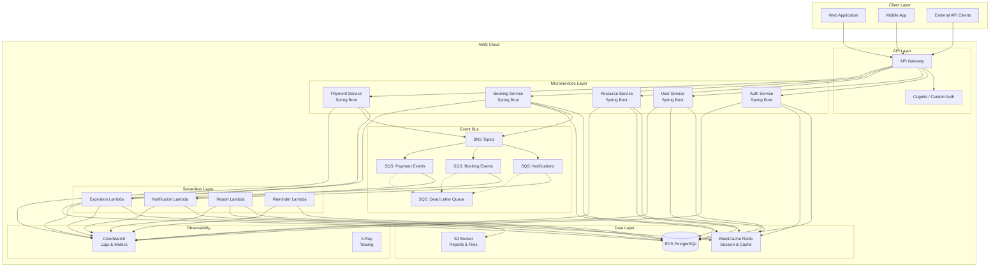
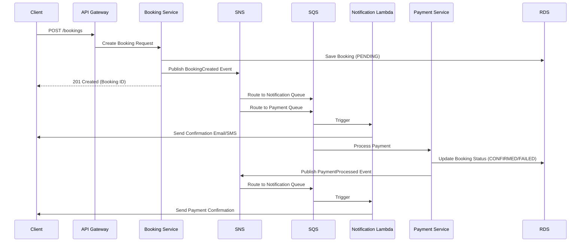
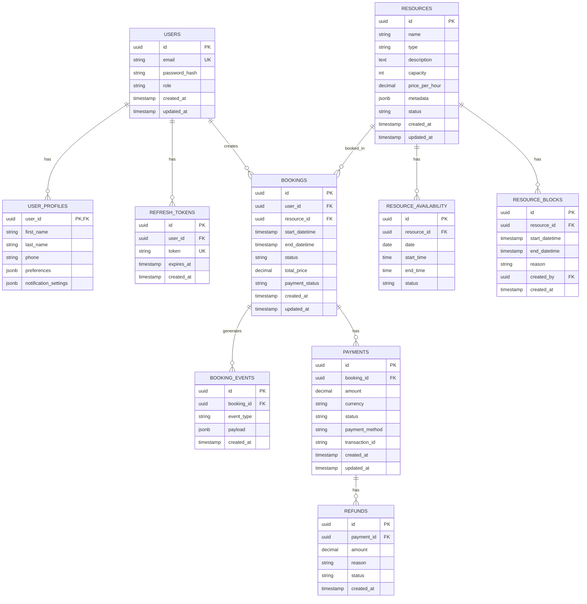
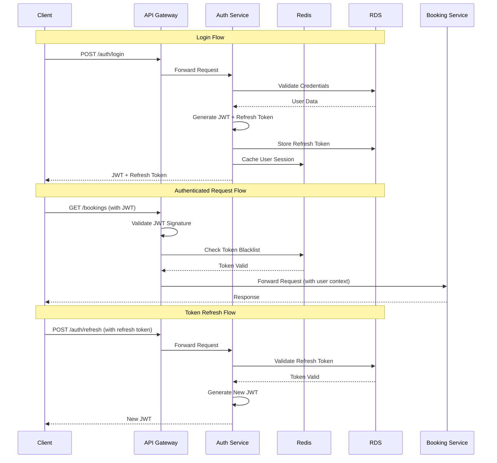
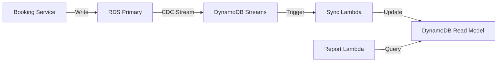

# 🏗️ Resource Booking Platform - Architecture Design

## 📋 Table of Contents
1. [System Overview](#system-overview)
2. [Architecture Diagram](#architecture-diagram)
3. [Microservices Design](#microservices-design)
4. [Database Schema](#database-schema)
5. [Event-Driven Architecture](#event-driven-architecture)
6. [API Gateway & Authentication](#api-gateway--authentication)
7. [Lambda Functions](#lambda-functions)
8. [Architecture Improvements](#architecture-improvements)
9. [Implementation Plan](#implementation-plan)
10. [Security Considerations](#security-considerations)

---

## System Overview

### Architecture Style
**Hybrid Architecture** combining:
- **Microservices** (Spring Boot) for core business logic
- **Serverless** (AWS Lambda) for event-driven, asynchronous tasks
- **Event-Driven Communication** via SQS/SNS

### Key Design Principles
- **Domain-Driven Design**: Clear bounded contexts
- **Event Sourcing**: Audit trail for bookings
- **CQRS Pattern**: Separate read/write models for reporting
- **Eventual Consistency**: For non-critical operations
- **Idempotency**: For all event handlers

---

## Architecture Diagram

### High-Level System Architecture



### Event Flow Diagram



---

## Microservices Design

### 1. Auth Service
**Responsibility**: Authentication, authorization, token management

**Endpoints**:
- `POST /auth/register` - User registration
- `POST /auth/login` - User login (returns JWT + refresh token)
- `POST /auth/refresh` - Refresh access token
- `POST /auth/logout` - Invalidate tokens
- `GET /auth/verify` - Verify token validity

**Technology Stack**:
- Spring Boot 3.x
- Spring Security 6.x
- JWT (jjwt library)
- BCrypt for password hashing
- Redis for token blacklist

**Database Tables**:
- `users` (id, email, password_hash, role, created_at, updated_at)
- `refresh_tokens` (id, user_id, token, expires_at, created_at)

---

### 2. User Service
**Responsibility**: User profile management

**Endpoints**:
- `GET /users/me` - Get current user profile
- `PUT /users/me` - Update user profile
- `GET /users/{id}` - Get user by ID (admin only)
- `GET /users` - List users (admin only)
- `DELETE /users/{id}` - Delete user (admin only)

**Technology Stack**:
- Spring Boot 3.x
- Spring Data JPA
- PostgreSQL
- Redis for caching

**Database Tables**:
- `user_profiles` (user_id, first_name, last_name, phone, preferences, notification_settings)

---

### 3. Resource Service
**Responsibility**: Resource catalog and availability management

**Endpoints**:
- `POST /resources` - Create resource (admin)
- `GET /resources` - List resources with filters
- `GET /resources/{id}` - Get resource details
- `PUT /resources/{id}` - Update resource (admin)
- `DELETE /resources/{id}` - Delete resource (admin)
- `GET /resources/{id}/availability` - Check availability for date range
- `POST /resources/{id}/block` - Block resource for maintenance (admin)

**Technology Stack**:
- Spring Boot 3.x
- Spring Data JPA
- PostgreSQL
- Redis for availability cache

**Database Tables**:
- `resources` (id, name, type, description, capacity, price_per_hour, metadata, status, created_at)
- `resource_availability` (id, resource_id, date, start_time, end_time, status)
- `resource_blocks` (id, resource_id, start_datetime, end_datetime, reason, created_by)

---

### 4. Booking Service
**Responsibility**: Booking lifecycle management

**Endpoints**:
- `POST /bookings` - Create booking
- `GET /bookings` - List user bookings
- `GET /bookings/{id}` - Get booking details
- `PUT /bookings/{id}/cancel` - Cancel booking
- `GET /bookings/resource/{resourceId}` - Get bookings for resource
- `PUT /bookings/{id}/confirm` - Confirm booking (internal)
- `PUT /bookings/{id}/expire` - Expire booking (internal)

**Technology Stack**:
- Spring Boot 3.x
- Spring Data JPA
- PostgreSQL
- AWS SNS SDK
- Redis for distributed locking

**Database Tables**:
- `bookings` (id, user_id, resource_id, start_datetime, end_datetime, status, total_price, payment_status, created_at, updated_at)
- `booking_events` (id, booking_id, event_type, payload, created_at) - Event sourcing

**Business Logic**:
- Validate resource availability
- Calculate pricing
- Implement optimistic locking for concurrent bookings
- Publish events to SNS

---

### 5. Payment Service
**Responsibility**: Payment processing (mock implementation)

**Endpoints**:
- `POST /payments/process` - Process payment
- `GET /payments/{id}` - Get payment details
- `GET /payments/booking/{bookingId}` - Get payments for booking
- `POST /payments/refund` - Process refund

**Technology Stack**:
- Spring Boot 3.x
- Spring Data JPA
- PostgreSQL
- AWS SQS SDK

**Database Tables**:
- `payments` (id, booking_id, amount, currency, status, payment_method, transaction_id, created_at, updated_at)
- `refunds` (id, payment_id, amount, reason, status, created_at)

**Mock Payment Logic**:
- Simulate payment processing with configurable success/failure rates
- Random delay to simulate real payment gateway
- Generate mock transaction IDs

---

## Database Schema

### Entity Relationship Diagram



### Key Indexes

```sql
-- Users
CREATE INDEX idx_users_email ON users(email);
CREATE INDEX idx_users_role ON users(role);

-- Bookings
CREATE INDEX idx_bookings_user_id ON bookings(user_id);
CREATE INDEX idx_bookings_resource_id ON bookings(resource_id);
CREATE INDEX idx_bookings_status ON bookings(status);
CREATE INDEX idx_bookings_start_datetime ON bookings(start_datetime);
CREATE INDEX idx_bookings_payment_status ON bookings(payment_status);

-- Resources
CREATE INDEX idx_resources_type ON resources(type);
CREATE INDEX idx_resources_status ON resources(status);

-- Resource Availability
CREATE INDEX idx_resource_availability_resource_date ON resource_availability(resource_id, date);

-- Payments
CREATE INDEX idx_payments_booking_id ON payments(booking_id);
CREATE INDEX idx_payments_status ON payments(status);
```

---

## Event-Driven Architecture

### SNS Topics

#### 1. booking-events-topic
**Purpose**: Central hub for all booking-related events

**Event Types**:
- `BookingCreated`
- `BookingConfirmed`
- `BookingCancelled`
- `BookingExpired`
- `BookingUpdated`

**Subscribers**:
- Notification SQS Queue
- Analytics SQS Queue
- Audit Log SQS Queue

#### 2. payment-events-topic
**Purpose**: Payment processing events

**Event Types**:
- `PaymentInitiated`
- `PaymentSucceeded`
- `PaymentFailed`
- `RefundProcessed`

**Subscribers**:
- Notification SQS Queue
- Booking Service (via SQS)

---

### SQS Queues

#### 1. notification-queue
**Purpose**: Process notification requests
**Visibility Timeout**: 30 seconds
**Message Retention**: 4 days
**DLQ**: notification-dlq (after 3 retries)

#### 2. booking-events-queue
**Purpose**: Process booking events for expiration
**Visibility Timeout**: 60 seconds
**Message Retention**: 7 days
**DLQ**: booking-events-dlq (after 5 retries)

#### 3. payment-events-queue
**Purpose**: Process payment events
**Visibility Timeout**: 30 seconds
**Message Retention**: 7 days
**DLQ**: payment-events-dlq (after 3 retries)

---

### Event Payload Schemas

#### BookingCreated Event
```json
{
  "eventId": "uuid",
  "eventType": "BookingCreated",
  "timestamp": "2026-01-24T23:00:00Z",
  "version": "1.0",
  "data": {
    "bookingId": "uuid",
    "userId": "uuid",
    "resourceId": "uuid",
    "resourceName": "string",
    "startDatetime": "2026-01-25T10:00:00Z",
    "endDatetime": "2026-01-25T12:00:00Z",
    "totalPrice": 100.00,
    "status": "PENDING"
  }
}
```

#### PaymentSucceeded Event
```json
{
  "eventId": "uuid",
  "eventType": "PaymentSucceeded",
  "timestamp": "2026-01-24T23:05:00Z",
  "version": "1.0",
  "data": {
    "paymentId": "uuid",
    "bookingId": "uuid",
    "amount": 100.00,
    "currency": "USD",
    "transactionId": "string",
    "paymentMethod": "CREDIT_CARD"
  }
}
```

---

## API Gateway & Authentication

### API Gateway Configuration

#### Base URL Structure
```
https://api.booking-platform.com/v1
```

#### Route Configuration

| Method | Path | Target | Auth Required |
|--------|------|--------|---------------|
| POST | /auth/register | Auth Service | No |
| POST | /auth/login | Auth Service | No |
| POST | /auth/refresh | Auth Service | No |
| POST | /auth/logout | Auth Service | Yes |
| GET | /users/me | User Service | Yes |
| PUT | /users/me | User Service | Yes |
| GET | /resources | Resource Service | No |
| GET | /resources/{id} | Resource Service | No |
| POST | /resources | Resource Service | Yes (Admin) |
| GET | /bookings | Booking Service | Yes |
| POST | /bookings | Booking Service | Yes |
| PUT | /bookings/{id}/cancel | Booking Service | Yes |

#### Request/Response Interceptors
- **Request Logging**: Log all incoming requests
- **Rate Limiting**: 100 requests per minute per IP
- **CORS**: Configure allowed origins
- **Request Validation**: Validate request schemas
- **Response Transformation**: Standardize error responses

---

### Authentication Flow



### JWT Token Structure

**Access Token** (15 minutes expiry):
```json
{
  "sub": "user-uuid",
  "email": "user@example.com",
  "role": "USER",
  "iat": 1706140800,
  "exp": 1706141700,
  "jti": "token-uuid"
}
```

**Refresh Token** (7 days expiry):
- Stored in database
- One-time use (rotated on refresh)
- Linked to user and device

---

## Lambda Functions

### 1. Notification Lambda
**Trigger**: SQS (notification-queue)
**Runtime**: Python 3.11 or Node.js 18
**Memory**: 512 MB
**Timeout**: 30 seconds

**Responsibilities**:
- Send email notifications via SES
- Send SMS notifications via SNS
- Send push notifications via FCM/APNS
- Support multiple notification channels via configuration

**Environment Variables**:
- `SES_SENDER_EMAIL`
- `SNS_SMS_TOPIC_ARN`
- `FCM_SERVER_KEY`
- `NOTIFICATION_TEMPLATES_BUCKET`

**Error Handling**:
- Retry failed notifications (max 3 attempts)
- Log failures to CloudWatch
- Send to DLQ after max retries

---

### 2. Expiration Lambda
**Trigger**: EventBridge (every 5 minutes)
**Runtime**: Java 17 (GraalVM Native)
**Memory**: 1024 MB
**Timeout**: 5 minutes

**Responsibilities**:
- Query bookings with status PENDING and created > 30 minutes ago
- Update booking status to EXPIRED
- Release resource availability
- Publish BookingExpired event to SNS

**Database Query**:
```sql
SELECT id FROM bookings 
WHERE status = 'PENDING' 
  AND payment_status = 'UNPAID'
  AND created_at < NOW() - INTERVAL '30 minutes'
LIMIT 100;
```

**Optimization**:
- Batch processing (100 bookings per run)
- Use database connection pooling
- Implement idempotency with processed_at timestamp

---

### 3. Report Lambda
**Trigger**: EventBridge (daily at 2 AM UTC)
**Runtime**: Python 3.11
**Memory**: 2048 MB
**Timeout**: 15 minutes

**Responsibilities**:
- Generate daily booking reports
- Generate revenue reports
- Generate resource utilization reports
- Store reports in S3 as CSV/JSON
- Send summary email to admins

**Report Types**:
1. **Daily Booking Summary**
   - Total bookings created
   - Total bookings confirmed
   - Total bookings cancelled
   - Revenue generated

2. **Resource Utilization**
   - Booking rate per resource
   - Peak usage hours
   - Idle resources

3. **User Analytics**
   - New user registrations
   - Active users
   - Top users by bookings

**S3 Structure**:
```
s3://booking-reports/
  ├── daily/
  │   ├── 2026-01-24/
  │   │   ├── booking-summary.json
  │   │   ├── revenue-report.csv
  │   │   └── resource-utilization.json
```

---

### 4. Reminder Lambda
**Trigger**: EventBridge (every hour)
**Runtime**: Node.js 18
**Memory**: 512 MB
**Timeout**: 5 minutes

**Responsibilities**:
- Query bookings starting in next 24 hours
- Send reminder notifications to users
- Mark reminders as sent to avoid duplicates

**Database Query**:
```sql
SELECT b.id, b.user_id, b.start_datetime, r.name
FROM bookings b
JOIN resources r ON b.resource_id = r.id
WHERE b.status = 'CONFIRMED'
  AND b.start_datetime BETWEEN NOW() AND NOW() + INTERVAL '24 hours'
  AND b.reminder_sent = false;
```

---

## Architecture Improvements

### Current Architecture Strengths
✅ Clear separation of concerns
✅ Event-driven for asynchronous operations
✅ Scalable microservices architecture
✅ Cost-effective serverless for background tasks
✅ Managed AWS services reduce operational overhead

### Proposed Improvements

#### 1. **Add API Gateway Caching**
**Problem**: Repeated requests for resource availability cause unnecessary database load

**Solution**:
- Enable API Gateway caching for GET /resources and GET /resources/{id}/availability
- Cache TTL: 60 seconds
- Invalidate cache on resource updates

**Benefits**:
- Reduced latency
- Lower database load
- Cost savings

---

#### 2. **Implement Circuit Breaker Pattern**
**Problem**: Service failures can cascade across microservices

**Solution**:
- Use Resilience4j in Spring Boot services
- Configure circuit breaker for inter-service calls
- Implement fallback mechanisms

**Configuration**:
```yaml
resilience4j:
  circuitbreaker:
    instances:
      paymentService:
        failureRateThreshold: 50
        waitDurationInOpenState: 10s
        slidingWindowSize: 10
```

**Benefits**:
- Prevent cascade failures
- Graceful degradation
- Improved system resilience

---

#### 3. **Add Read Replicas for RDS**
**Problem**: Heavy read operations (reports, availability checks) impact write performance

**Solution**:
- Create RDS read replica
- Route read-only queries to replica
- Use Spring Boot's `@Transactional(readOnly = true)`

**Benefits**:
- Improved read performance
- Reduced load on primary database
- Better scalability

---

#### 4. **Implement CQRS for Reporting**
**Problem**: Complex reporting queries slow down operational database

**Solution**:
- Create separate read model in DynamoDB or ElasticSearch
- Use Lambda to sync data from RDS to read model
- Query read model for reports and analytics

**Architecture**:


**Benefits**:
- Optimized read/write models
- Faster reporting queries
- Reduced operational database load

---

#### 5. **Add Distributed Tracing**
**Problem**: Difficult to debug issues across microservices and lambdas

**Solution**:
- Implement AWS X-Ray across all services
- Add correlation IDs to all requests
- Use Spring Cloud Sleuth for automatic instrumentation

**Benefits**:
- End-to-end request tracing
- Performance bottleneck identification
- Easier debugging

---

#### 6. **Implement Saga Pattern for Booking Flow**
**Problem**: Booking creation involves multiple services (booking, payment, notification) - partial failures leave system in inconsistent state

**Solution**:
- Implement orchestration-based saga
- Create BookingSaga orchestrator
- Define compensating transactions for rollback

**Saga Steps**:
1. Reserve resource (compensate: release reservation)
2. Create booking (compensate: delete booking)
3. Process payment (compensate: refund payment)
4. Send confirmation (no compensation needed)

**Benefits**:
- Data consistency across services
- Automatic rollback on failures
- Clear transaction boundaries

---

#### 7. **Add GraphQL API Layer**
**Problem**: Mobile clients make multiple REST calls to fetch related data

**Solution**:
- Add AWS AppSync or Spring GraphQL
- Create unified schema for bookings, resources, users
- Enable clients to fetch exactly what they need

**Example Query**:
```graphql
query GetBookingDetails($id: ID!) {
  booking(id: $id) {
    id
    startDatetime
    endDatetime
    status
    resource {
      name
      type
      capacity
    }
    payment {
      amount
      status
    }
  }
}
```

**Benefits**:
- Reduced network requests
- Better mobile performance
- Flexible data fetching

---

#### 8. **Implement Event Sourcing for Bookings**
**Problem**: No audit trail for booking state changes

**Solution**:
- Store all booking events in event store
- Rebuild booking state from events
- Enable time-travel debugging

**Event Store Schema**:
```sql
CREATE TABLE booking_event_store (
    id UUID PRIMARY KEY,
    booking_id UUID NOT NULL,
    event_type VARCHAR(50) NOT NULL,
    event_data JSONB NOT NULL,
    version INT NOT NULL,
    created_at TIMESTAMP NOT NULL,
    UNIQUE(booking_id, version)
);
```

**Benefits**:
- Complete audit trail
- Temporal queries
- Event replay capability

---

#### 9. **Add Rate Limiting per User**
**Problem**: API Gateway rate limiting is per IP, not per user

**Solution**:
- Implement Redis-based rate limiting in services
- Use Spring Boot interceptor
- Configure limits per user role

**Implementation**:
```java
@Component
public class RateLimitInterceptor implements HandlerInterceptor {
    @Override
    public boolean preHandle(HttpServletRequest request, 
                            HttpServletResponse response, 
                            Object handler) {
        String userId = extractUserId(request);
        if (!rateLimiter.tryAcquire(userId)) {
            response.setStatus(429);
            return false;
        }
        return true;
    }
}
```

**Benefits**:
- Fair resource usage
- Prevent abuse
- Better user experience

---

#### 10. **Add Webhook Support**
**Problem**: External systems need real-time booking updates

**Solution**:
- Create webhook service
- Allow users to register webhook URLs
- Deliver events via HTTP POST with retry logic

**Webhook Events**:
- `booking.created`
- `booking.confirmed`
- `booking.cancelled`
- `payment.succeeded`

**Benefits**:
- Real-time integrations
- Extensibility
- Third-party ecosystem

---

## Implementation Plan

### Phase 1: Foundation (Weeks 1-3)
**Goal**: Set up infrastructure and core services

#### Week 1: Infrastructure Setup
- [ ] Set up AWS account and configure IAM roles
- [ ] Create VPC with public/private subnets
- [ ] Set up RDS PostgreSQL instance
- [ ] Configure ElastiCache Redis cluster
- [ ] Set up S3 buckets for reports and files
- [ ] Configure CloudWatch log groups
- [ ] Set up API Gateway

#### Week 2: Auth & User Services
- [ ] Create Spring Boot project structure
- [ ] Implement Auth Service with JWT
- [ ] Implement User Service
- [ ] Set up database migrations with Flyway
- [ ] Create user and auth tables
- [ ] Implement password hashing and validation
- [ ] Add Redis integration for token blacklist
- [ ] Write unit tests for auth logic

#### Week 3: Resource Service
- [ ] Implement Resource Service
- [ ] Create resource and availability tables
- [ ] Implement CRUD operations for resources
- [ ] Implement availability checking logic
- [ ] Add caching for resource queries
- [ ] Implement resource blocking functionality
- [ ] Write unit and integration tests
- [ ] Document API endpoints

---

### Phase 2: Core Booking Logic (Weeks 4-6)

#### Week 4: Booking Service - Part 1
- [ ] Implement Booking Service structure
- [ ] Create booking tables with indexes
- [ ] Implement booking creation with validation
- [ ] Add optimistic locking for concurrent bookings
- [ ] Implement availability checking
- [ ] Add pricing calculation logic
- [ ] Write unit tests for booking logic

#### Week 5: Booking Service - Part 2
- [ ] Implement booking cancellation
- [ ] Add booking status management
- [ ] Implement booking queries and filters
- [ ] Set up SNS topics for events
- [ ] Implement event publishing
- [ ] Add event sourcing for audit trail
- [ ] Write integration tests

#### Week 6: Payment Service
- [ ] Implement Payment Service
- [ ] Create payment and refund tables
- [ ] Implement mock payment processing
- [ ] Add payment status tracking
- [ ] Implement refund logic
- [ ] Integrate with booking service
- [ ] Set up SQS queues for payment events
- [ ] Write unit and integration tests

---

### Phase 3: Event-Driven Components (Weeks 7-8)

#### Week 7: Lambda Functions - Part 1
- [ ] Set up Lambda deployment pipeline
- [ ] Implement Notification Lambda
- [ ] Configure SES for email notifications
- [ ] Configure SNS for SMS notifications
- [ ] Create notification templates
- [ ] Implement multi-channel notification logic
- [ ] Set up SQS triggers
- [ ] Add error handling and DLQ

#### Week 8: Lambda Functions - Part 2
- [ ] Implement Expiration Lambda
- [ ] Set up EventBridge schedule
- [ ] Implement batch expiration logic
- [ ] Add idempotency checks
- [ ] Implement Reminder Lambda
- [ ] Create reminder notification templates
- [ ] Implement Report Lambda
- [ ] Set up S3 report storage
- [ ] Write Lambda tests

---

### Phase 4: Integration & Testing (Weeks 9-10)

#### Week 9: API Gateway Integration
- [ ] Configure API Gateway routes
- [ ] Set up request/response transformations
- [ ] Implement CORS configuration
- [ ] Add rate limiting
- [ ] Configure API Gateway caching
- [ ] Set up custom domain
- [ ] Configure SSL certificates
- [ ] Test end-to-end flows

#### Week 10: Testing & Documentation
- [ ] Write end-to-end integration tests
- [ ] Perform load testing with JMeter/Gatling
- [ ] Test failure scenarios
- [ ] Verify event delivery and retries
- [ ] Test Lambda cold starts
- [ ] Create API documentation with Swagger
- [ ] Write deployment documentation
- [ ] Create runbooks for operations

---

### Phase 5: Observability & Optimization (Weeks 11-12)

#### Week 11: Observability
- [ ] Set up CloudWatch dashboards
- [ ] Configure custom metrics
- [ ] Implement AWS X-Ray tracing
- [ ] Add correlation IDs to all requests
- [ ] Set up CloudWatch alarms
- [ ] Configure SNS for alerts
- [ ] Create log aggregation queries
- [ ] Set up log retention policies

#### Week 12: Optimization & Launch Prep
- [ ] Optimize database queries
- [ ] Add database indexes based on query patterns
- [ ] Optimize Lambda cold starts
- [ ] Configure auto-scaling for services
- [ ] Perform security audit
- [ ] Review IAM policies
- [ ] Create disaster recovery plan
- [ ] Prepare launch checklist

---

### Phase 6: Advanced Features (Weeks 13-14)

#### Week 13: Architecture Improvements
- [ ] Implement circuit breaker pattern
- [ ] Add RDS read replicas
- [ ] Implement distributed caching strategy
- [ ] Add API versioning
- [ ] Implement webhook support
- [ ] Add rate limiting per user
- [ ] Optimize event processing

#### Week 14: Polish & Documentation
- [ ] Create architecture diagrams
- [ ] Write technical documentation
- [ ] Create user guides
- [ ] Perform final security review
- [ ] Create backup and restore procedures
- [ ] Document monitoring and alerting
- [ ] Prepare handover documentation
- [ ] Conduct final review

---

## Security Considerations

### 1. Authentication & Authorization

#### JWT Security
- Use strong signing algorithm (RS256 or ES256)
- Short access token expiry (15 minutes)
- Implement token rotation for refresh tokens
- Store refresh tokens securely in database
- Implement token blacklist in Redis

#### Password Security
- Use BCrypt with cost factor 12+
- Enforce strong password policy
- Implement account lockout after failed attempts
- Add CAPTCHA for login after 3 failures
- Support multi-factor authentication (future)

#### API Security
- Validate all input parameters
- Implement request signing for sensitive operations
- Use HTTPS only (TLS 1.3)
- Implement CORS properly
- Add security headers (HSTS, CSP, X-Frame-Options)

---

### 2. Data Protection

#### Encryption at Rest
- Enable RDS encryption
- Enable S3 bucket encryption
- Use AWS KMS for key management
- Encrypt sensitive fields in database (PII)

#### Encryption in Transit
- Use TLS 1.3 for all communications
- Enable SSL for RDS connections
- Use VPC endpoints for AWS services
- Implement mutual TLS for service-to-service

#### Data Privacy
- Implement data retention policies
- Add GDPR compliance features (data export, deletion)
- Anonymize data in logs
- Mask sensitive data in responses

---

### 3. Network Security

#### VPC Configuration
- Use private subnets for services and databases
- Use public subnets only for load balancers
- Implement security groups with least privilege
- Use NACLs for additional layer
- Enable VPC Flow Logs

#### Service Isolation
- Each microservice in separate security group
- Database accessible only from service subnets
- Lambda functions in VPC for database access
- Use AWS PrivateLink for AWS services

---

### 4. Application Security

#### Input Validation
- Validate all user inputs
- Use parameterized queries (prevent SQL injection)
- Sanitize data before storage
- Implement request size limits
- Validate file uploads

#### Error Handling
- Never expose stack traces to clients
- Log errors securely
- Implement generic error messages
- Add error tracking (Sentry/Rollbar)

#### Dependency Management
- Regular dependency updates
- Use Dependabot for vulnerability scanning
- Implement OWASP dependency check
- Use minimal base images for containers

---

### 5. Monitoring & Incident Response

#### Security Monitoring
- Enable AWS GuardDuty
- Monitor CloudTrail logs
- Set up alerts for suspicious activity
- Implement anomaly detection
- Regular security audits

#### Incident Response
- Create incident response plan
- Define escalation procedures
- Implement automated remediation
- Regular security drills
- Post-incident reviews

---

### 6. Compliance & Auditing

#### Audit Logging
- Log all authentication attempts
- Log all data access
- Log all administrative actions
- Implement immutable audit logs
- Regular audit log reviews

#### Compliance
- Document security controls
- Regular compliance assessments
- Implement data residency requirements
- Create compliance reports
- Regular penetration testing

---

## Technology Stack Summary

### Backend Services
- **Language**: Java 17/21
- **Framework**: Spring Boot 3.x
- **Security**: Spring Security 6.x
- **Data Access**: Spring Data JPA
- **API Documentation**: SpringDoc OpenAPI
- **Testing**: JUnit 5, Mockito, TestContainers
- **Build Tool**: Maven or Gradle

### Serverless
- **Runtime**: Python 3.11, Node.js 18, Java 17 (GraalVM)
- **Framework**: AWS SAM or Serverless Framework
- **Testing**: pytest, jest, JUnit

### Database
- **Primary**: PostgreSQL 15+ (RDS)
- **Cache**: Redis 7+ (ElastiCache)
- **Migration**: Flyway or Liquibase

### AWS Services
- **Compute**: ECS Fargate or EKS
- **API**: API Gateway
- **Messaging**: SNS, SQS
- **Storage**: S3
- **Monitoring**: CloudWatch, X-Ray
- **Security**: IAM, KMS, Secrets Manager

### DevOps
- **CI/CD**: GitHub Actions or AWS CodePipeline
- **IaC**: Terraform or AWS CDK
- **Containerization**: Docker
- **Orchestration**: ECS or Kubernetes

---

## Next Steps

1. **Review this architecture plan** and provide feedback
2. **Prioritize features** if timeline needs adjustment
3. **Clarify any requirements** that need more detail
4. **Approve the plan** to proceed with implementation
5. **Set up development environment** and begin Phase 1

---

## Questions for Discussion

1. Should we use ECS Fargate or EKS for container orchestration?
2. Do you want to implement multi-tenancy support?
3. Should we add a frontend application to the scope?
4. What's the expected scale (users, bookings per day)?
5. Are there any specific compliance requirements (HIPAA, PCI-DSS)?
6. Should we implement real-time features (WebSocket for live availability)?
7. Do you want to add analytics and business intelligence features?

---

**Document Version**: 1.0  
**Last Updated**: 2026-01-24  
**Author**: Architecture Team
