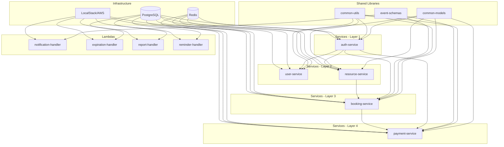

# 🚀 Implementation Plan - Resource Booking Platform Monorepo

## 📁 Repository Structure

```
booking-platform/                           # Root monorepo
├── README.md                               # Project overview and setup
├── docker-compose.yml                      # Integration testing - all services
├── docker-compose.localstack.yml           # LocalStack for AWS services
├── .gitignore                              # Git ignore patterns
├── .env.example                            # Environment variables template
│
├── docs/                                   # Documentation
│   ├── architecture.md                     # System architecture
│   ├── architecture-qa.md                  # Architecture Q&A
│   ├── api-documentation.md                # API specs
│   ├── deployment-guide.md                 # Deployment instructions
│   └── development-guide.md                # Development setup
│
├── infrastructure/                         # Infrastructure as Code
│   ├── terraform/                          # Terraform configurations
│   │   ├── modules/                        # Reusable modules
│   │   │   ├── vpc/                        # VPC module
│   │   │   ├── rds/                        # RDS module
│   │   │   ├── elasticache/                # ElastiCache module
│   │   │   ├── sns-sqs/                    # SNS/SQS module
│   │   │   └── lambda/                     # Lambda module
│   │   ├── environments/                   # Environment configs
│   │   │   ├── local/                      # LocalStack config
│   │   │   ├── dev/                        # Dev environment
│   │   │   ├── staging/                    # Staging environment
│   │   │   └── prod/                       # Production environment
│   │   └── README.md                       # Terraform documentation
│   │
│   └── cloudformation/                     # CloudFormation (alternative)
│       ├── templates/                      # CF templates
│       └── README.md                       # CloudFormation docs
│
├── scripts/                                # Utility scripts
│   ├── setup-local.sh                      # Initialize local environment
│   ├── start-services.sh                   # Start all services
│   ├── stop-services.sh                    # Stop all services
│   ├── run-tests.sh                        # Run all tests
│   ├── deploy-lambdas.sh                   # Deploy Lambda functions
│   ├── seed-data.sh                        # Seed test data
│   └── cleanup.sh                          # Cleanup resources
│
├── shared/                                 # Shared libraries
│   ├── common-models/                      # Shared data models
│   │   ├── src/
│   │   ├── pom.xml
│   │   └── README.md
│   ├── common-utils/                       # Shared utilities
│   │   ├── src/
│   │   ├── pom.xml
│   │   └── README.md
│   └── event-schemas/                      # Event definitions
│       ├── booking-events.json
│       ├── payment-events.json
│       └── README.md
│
├── services/                               # Microservices
│   ├── auth-service/                       # Authentication service
│   │   ├── src/
│   │   ├── pom.xml
│   │   ├── Dockerfile
│   │   ├── docker-compose.yml              # Isolated testing
│   │   ├── .env.example
│   │   └── README.md
│   │
│   ├── user-service/                       # User management service
│   │   ├── src/
│   │   ├── pom.xml
│   │   ├── Dockerfile
│   │   ├── docker-compose.yml
│   │   ├── .env.example
│   │   └── README.md
│   │
│   ├── resource-service/                   # Resource management service
│   │   ├── src/
│   │   ├── pom.xml
│   │   ├── Dockerfile
│   │   ├── docker-compose.yml
│   │   ├── .env.example
│   │   └── README.md
│   │
│   ├── booking-service/                    # Booking management service
│   │   ├── src/
│   │   ├── pom.xml
│   │   ├── Dockerfile
│   │   ├── docker-compose.yml
│   │   ├── .env.example
│   │   └── README.md
│   │
│   └── payment-service/                    # Payment processing service
│       ├── src/
│       ├── pom.xml
│       ├── Dockerfile
│       ├── docker-compose.yml
│       ├── .env.example
│       └── README.md
│
├── lambdas/                                # Lambda functions
│   ├── notification-handler/               # Notification Lambda
│   │   ├── src/
│   │   ├── package.json
│   │   ├── Dockerfile
│   │   ├── docker-compose.yml
│   │   ├── .env.example
│   │   └── README.md
│   │
│   ├── expiration-handler/                 # Expiration Lambda
│   │   ├── src/
│   │   ├── pom.xml
│   │   ├── Dockerfile
│   │   ├── docker-compose.yml
│   │   ├── .env.example
│   │   └── README.md
│   │
│   ├── report-handler/                     # Report Lambda
│   │   ├── src/
│   │   ├── requirements.txt
│   │   ├── Dockerfile
│   │   ├── docker-compose.yml
│   │   ├── .env.example
│   │   └── README.md
│   │
│   └── reminder-handler/                   # Reminder Lambda
│       ├── src/
│       ├── package.json
│       ├── Dockerfile
│       ├── docker-compose.yml
│       ├── .env.example
│       └── README.md
│
├── database/                               # Database scripts
│   ├── migrations/                         # Flyway migrations
│   │   ├── V1__create_auth_schema.sql
│   │   ├── V2__create_user_schema.sql
│   │   ├── V3__create_resource_schema.sql
│   │   ├── V4__create_booking_schema.sql
│   │   └── V5__create_payment_schema.sql
│   ├── seeds/                              # Seed data
│   │   ├── dev/
│   │   └── test/
│   └── README.md
│
├── tests/                                  # Integration & E2E tests
│   ├── integration/                        # Integration tests
│   │   ├── auth-flow.test.js
│   │   ├── booking-flow.test.js
│   │   └── payment-flow.test.js
│   ├── e2e/                                # End-to-end tests
│   │   ├── complete-booking.test.js
│   │   └── booking-cancellation.test.js
│   ├── performance/                        # Load tests
│   │   └── booking-load.jmx
│   └── README.md
│
└── .github/                                # GitHub workflows (optional)
    └── workflows/
        ├── ci.yml                          # Continuous Integration
        ├── cd.yml                          # Continuous Deployment
        └── test.yml                        # Automated testing
```

---

## 🎯 Component-Level Docker Compose Strategy

### Pattern: Each Component is Self-Contained

Each service/lambda has its own `docker-compose.yml` that includes:
1. The service itself
2. Only the dependencies it needs (database, cache, message queue)
3. LocalStack for AWS services (if needed)

### Example: Auth Service Docker Compose

```yaml
# services/auth-service/docker-compose.yml
version: '3.8'

services:
  # Auth Service
  auth-service:
    build:
      context: .
      dockerfile: Dockerfile
    ports:
      - "8081:8080"
    environment:
      - SPRING_PROFILES_ACTIVE=local
      - DB_HOST=postgres
      - DB_PORT=5432
      - DB_NAME=booking_platform
      - REDIS_HOST=redis
      - REDIS_PORT=6379
    depends_on:
      postgres:
        condition: service_healthy
      redis:
        condition: service_healthy
    networks:
      - auth-network

  # PostgreSQL (only auth schema)
  postgres:
    image: postgres:15-alpine
    ports:
      - "5432:5432"
    environment:
      - POSTGRES_DB=booking_platform
      - POSTGRES_USER=booking_user
      - POSTGRES_PASSWORD=booking_pass
    volumes:
      - postgres-data:/var/lib/postgresql/data
      - ../../database/migrations:/docker-entrypoint-initdb.d
    healthcheck:
      test: ["CMD-SHELL", "pg_isready -U booking_user"]
      interval: 5s
      timeout: 5s
      retries: 5
    networks:
      - auth-network

  # Redis
  redis:
    image: redis:7-alpine
    ports:
      - "6379:6379"
    healthcheck:
      test: ["CMD", "redis-cli", "ping"]
      interval: 5s
      timeout: 3s
      retries: 5
    networks:
      - auth-network

volumes:
  postgres-data:

networks:
  auth-network:
    driver: bridge
```

### Example: Booking Service Docker Compose

```yaml
# services/booking-service/docker-compose.yml
version: '3.8'

services:
  # Booking Service
  booking-service:
    build:
      context: .
      dockerfile: Dockerfile
    ports:
      - "8084:8080"
    environment:
      - SPRING_PROFILES_ACTIVE=local
      - DB_HOST=postgres
      - REDIS_HOST=redis
      - AWS_ENDPOINT=http://localstack:4566
    depends_on:
      postgres:
        condition: service_healthy
      redis:
        condition: service_healthy
      localstack:
        condition: service_healthy
    networks:
      - booking-network

  # PostgreSQL
  postgres:
    image: postgres:15-alpine
    ports:
      - "5433:5432"  # Different port to avoid conflicts
    environment:
      - POSTGRES_DB=booking_platform
      - POSTGRES_USER=booking_user
      - POSTGRES_PASSWORD=booking_pass
    volumes:
      - postgres-data:/var/lib/postgresql/data
      - ../../database/migrations:/docker-entrypoint-initdb.d
    healthcheck:
      test: ["CMD-SHELL", "pg_isready -U booking_user"]
      interval: 5s
      timeout: 5s
      retries: 5
    networks:
      - booking-network

  # Redis
  redis:
    image: redis:7-alpine
    ports:
      - "6380:6379"  # Different port
    healthcheck:
      test: ["CMD", "redis-cli", "ping"]
      interval: 5s
      timeout: 3s
      retries: 5
    networks:
      - booking-network

  # LocalStack (SNS/SQS)
  localstack:
    image: localstack/localstack:latest
    ports:
      - "4566:4566"
    environment:
      - SERVICES=sns,sqs
      - DEBUG=1
      - DATA_DIR=/tmp/localstack/data
    volumes:
      - localstack-data:/tmp/localstack
      - ./localstack-init:/etc/localstack/init/ready.d
    healthcheck:
      test: ["CMD", "curl", "-f", "http://localhost:4566/_localstack/health"]
      interval: 10s
      timeout: 5s
      retries: 5
    networks:
      - booking-network

volumes:
  postgres-data:
  localstack-data:

networks:
  booking-network:
    driver: bridge
```

### Example: Notification Lambda Docker Compose

```yaml
# lambdas/notification-handler/docker-compose.yml
version: '3.8'

services:
  # Notification Lambda (running as container for testing)
  notification-handler:
    build:
      context: .
      dockerfile: Dockerfile
    environment:
      - AWS_ENDPOINT=http://localstack:4566
      - SQS_QUEUE_URL=http://localstack:4566/000000000000/notification-queue
      - SES_SENDER_EMAIL=noreply@booking-platform.local
    depends_on:
      localstack:
        condition: service_healthy
    networks:
      - lambda-network

  # LocalStack (SQS, SNS, SES)
  localstack:
    image: localstack/localstack:latest
    ports:
      - "4567:4566"  # Different port
    environment:
      - SERVICES=sqs,sns,ses
      - DEBUG=1
    volumes:
      - localstack-data:/tmp/localstack
      - ./localstack-init:/etc/localstack/init/ready.d
    healthcheck:
      test: ["CMD", "curl", "-f", "http://localhost:4566/_localstack/health"]
      interval: 10s
      timeout: 5s
      retries: 5
    networks:
      - lambda-network

volumes:
  localstack-data:

networks:
  lambda-network:
    driver: bridge
```

---

## 🔗 Root-Level Docker Compose for Integration Testing

```yaml
# docker-compose.yml (root level)
version: '3.8'

services:
  # ============================================
  # Infrastructure Services
  # ============================================
  
  postgres:
    image: postgres:15-alpine
    ports:
      - "5432:5432"
    environment:
      - POSTGRES_DB=booking_platform
      - POSTGRES_USER=booking_user
      - POSTGRES_PASSWORD=booking_pass
    volumes:
      - postgres-data:/var/lib/postgresql/data
      - ./database/migrations:/docker-entrypoint-initdb.d
    healthcheck:
      test: ["CMD-SHELL", "pg_isready -U booking_user"]
      interval: 5s
      timeout: 5s
      retries: 5
    networks:
      - booking-platform

  redis:
    image: redis:7-alpine
    ports:
      - "6379:6379"
    healthcheck:
      test: ["CMD", "redis-cli", "ping"]
      interval: 5s
      timeout: 3s
      retries: 5
    networks:
      - booking-platform

  localstack:
    image: localstack/localstack:latest
    ports:
      - "4566:4566"
    environment:
      - SERVICES=apigateway,lambda,sns,sqs,s3,cloudwatch,iam,ses
      - DEBUG=1
      - DATA_DIR=/tmp/localstack/data
      - LAMBDA_EXECUTOR=docker
      - DOCKER_HOST=unix:///var/run/docker.sock
    volumes:
      - localstack-data:/tmp/localstack
      - /var/run/docker.sock:/var/run/docker.sock
      - ./infrastructure/terraform/environments/local:/etc/localstack/init/ready.d
    healthcheck:
      test: ["CMD", "curl", "-f", "http://localhost:4566/_localstack/health"]
      interval: 10s
      timeout: 5s
      retries: 5
    networks:
      - booking-platform

  # ============================================
  # Microservices
  # ============================================

  auth-service:
    build:
      context: ./services/auth-service
      dockerfile: Dockerfile
    ports:
      - "8081:8080"
    environment:
      - SPRING_PROFILES_ACTIVE=docker
      - DB_HOST=postgres
      - DB_PORT=5432
      - DB_NAME=booking_platform
      - REDIS_HOST=redis
      - REDIS_PORT=6379
    depends_on:
      postgres:
        condition: service_healthy
      redis:
        condition: service_healthy
    networks:
      - booking-platform
    healthcheck:
      test: ["CMD", "curl", "-f", "http://localhost:8080/actuator/health"]
      interval: 10s
      timeout: 5s
      retries: 5

  user-service:
    build:
      context: ./services/user-service
      dockerfile: Dockerfile
    ports:
      - "8082:8080"
    environment:
      - SPRING_PROFILES_ACTIVE=docker
      - DB_HOST=postgres
      - REDIS_HOST=redis
      - AUTH_SERVICE_URL=http://auth-service:8080
    depends_on:
      postgres:
        condition: service_healthy
      redis:
        condition: service_healthy
      auth-service:
        condition: service_healthy
    networks:
      - booking-platform
    healthcheck:
      test: ["CMD", "curl", "-f", "http://localhost:8080/actuator/health"]
      interval: 10s
      timeout: 5s
      retries: 5

  resource-service:
    build:
      context: ./services/resource-service
      dockerfile: Dockerfile
    ports:
      - "8083:8080"
    environment:
      - SPRING_PROFILES_ACTIVE=docker
      - DB_HOST=postgres
      - REDIS_HOST=redis
      - AUTH_SERVICE_URL=http://auth-service:8080
    depends_on:
      postgres:
        condition: service_healthy
      redis:
        condition: service_healthy
      auth-service:
        condition: service_healthy
    networks:
      - booking-platform
    healthcheck:
      test: ["CMD", "curl", "-f", "http://localhost:8080/actuator/health"]
      interval: 10s
      timeout: 5s
      retries: 5

  booking-service:
    build:
      context: ./services/booking-service
      dockerfile: Dockerfile
    ports:
      - "8084:8080"
    environment:
      - SPRING_PROFILES_ACTIVE=docker
      - DB_HOST=postgres
      - REDIS_HOST=redis
      - AUTH_SERVICE_URL=http://auth-service:8080
      - RESOURCE_SERVICE_URL=http://resource-service:8080
      - AWS_ENDPOINT=http://localstack:4566
      - SNS_BOOKING_TOPIC_ARN=arn:aws:sns:us-east-1:000000000000:booking-events-topic
    depends_on:
      postgres:
        condition: service_healthy
      redis:
        condition: service_healthy
      localstack:
        condition: service_healthy
      auth-service:
        condition: service_healthy
      resource-service:
        condition: service_healthy
    networks:
      - booking-platform
    healthcheck:
      test: ["CMD", "curl", "-f", "http://localhost:8080/actuator/health"]
      interval: 10s
      timeout: 5s
      retries: 5

  payment-service:
    build:
      context: ./services/payment-service
      dockerfile: Dockerfile
    ports:
      - "8085:8080"
    environment:
      - SPRING_PROFILES_ACTIVE=docker
      - DB_HOST=postgres
      - REDIS_HOST=redis
      - AUTH_SERVICE_URL=http://auth-service:8080
      - AWS_ENDPOINT=http://localstack:4566
      - SNS_PAYMENT_TOPIC_ARN=arn:aws:sns:us-east-1:000000000000:payment-events-topic
    depends_on:
      postgres:
        condition: service_healthy
      redis:
        condition: service_healthy
      localstack:
        condition: service_healthy
      auth-service:
        condition: service_healthy
    networks:
      - booking-platform
    healthcheck:
      test: ["CMD", "curl", "-f", "http://localhost:8080/actuator/health"]
      interval: 10s
      timeout: 5s
      retries: 5

  # ============================================
  # Lambda Functions (as containers for testing)
  # ============================================

  notification-handler:
    build:
      context: ./lambdas/notification-handler
      dockerfile: Dockerfile
    environment:
      - AWS_ENDPOINT=http://localstack:4566
      - SQS_QUEUE_URL=http://localstack:4566/000000000000/notification-queue
    depends_on:
      localstack:
        condition: service_healthy
    networks:
      - booking-platform

  expiration-handler:
    build:
      context: ./lambdas/expiration-handler
      dockerfile: Dockerfile
    environment:
      - AWS_ENDPOINT=http://localstack:4566
      - DB_HOST=postgres
      - DB_PORT=5432
      - DB_NAME=booking_platform
    depends_on:
      postgres:
        condition: service_healthy
      localstack:
        condition: service_healthy
    networks:
      - booking-platform

  report-handler:
    build:
      context: ./lambdas/report-handler
      dockerfile: Dockerfile
    environment:
      - AWS_ENDPOINT=http://localstack:4566
      - DB_HOST=postgres
      - S3_BUCKET=booking-reports
    depends_on:
      postgres:
        condition: service_healthy
      localstack:
        condition: service_healthy
    networks:
      - booking-platform

  reminder-handler:
    build:
      context: ./lambdas/reminder-handler
      dockerfile: Dockerfile
    environment:
      - AWS_ENDPOINT=http://localstack:4566
      - DB_HOST=postgres
    depends_on:
      postgres:
        condition: service_healthy
      localstack:
        condition: service_healthy
    networks:
      - booking-platform

volumes:
  postgres-data:
  localstack-data:

networks:
  booking-platform:
    driver: bridge
```

---

## 🏗️ Terraform Structure

### Module-Based Approach

```hcl
# infrastructure/terraform/environments/local/main.tf
terraform {
  required_version = ">= 1.5"
  
  required_providers {
    aws = {
      source  = "hashicorp/aws"
      version = "~> 5.0"
    }
  }
}

# LocalStack provider configuration
provider "aws" {
  region                      = "us-east-1"
  access_key                  = "test"
  secret_key                  = "test"
  skip_credentials_validation = true
  skip_metadata_api_check     = true
  skip_requesting_account_id  = true

  endpoints {
    apigateway     = "http://localhost:4566"
    cloudformation = "http://localhost:4566"
    cloudwatch     = "http://localhost:4566"
    dynamodb       = "http://localhost:4566"
    ec2            = "http://localhost:4566"
    es             = "http://localhost:4566"
    elasticache    = "http://localhost:4566"
    firehose       = "http://localhost:4566"
    iam            = "http://localhost:4566"
    kinesis        = "http://localhost:4566"
    lambda         = "http://localhost:4566"
    rds            = "http://localhost:4566"
    redshift       = "http://localhost:4566"
    route53        = "http://localhost:4566"
    s3             = "http://s3.localhost.localstack.cloud:4566"
    secretsmanager = "http://localhost:4566"
    ses            = "http://localhost:4566"
    sns            = "http://localhost:4566"
    sqs            = "http://localhost:4566"
    ssm            = "http://localhost:4566"
    stepfunctions  = "http://localhost:4566"
    sts            = "http://localhost:4566"
  }
}

# Use modules
module "sns_sqs" {
  source = "../../modules/sns-sqs"
  
  environment = "local"
  
  topics = {
    booking_events = "booking-events-topic"
    payment_events = "payment-events-topic"
  }
  
  queues = {
    notification = {
      name                       = "notification-queue"
      visibility_timeout_seconds = 30
      message_retention_seconds  = 345600
      max_receive_count          = 3
    }
    booking_events = {
      name                       = "booking-events-queue"
      visibility_timeout_seconds = 60
      message_retention_seconds  = 604800
      max_receive_count          = 5
    }
    payment_events = {
      name                       = "payment-events-queue"
      visibility_timeout_seconds = 30
      message_retention_seconds  = 604800
      max_receive_count          = 3
    }
  }
}

module "s3" {
  source = "../../modules/s3"
  
  environment = "local"
  
  buckets = {
    reports = "booking-reports"
  }
}

module "lambda" {
  source = "../../modules/lambda"
  
  environment = "local"
  
  functions = {
    notification = {
      name          = "notification-handler"
      runtime       = "nodejs18.x"
      handler       = "index.handler"
      timeout       = 30
      memory_size   = 512
      source_path   = "../../../../lambdas/notification-handler"
      environment_variables = {
        SQS_QUEUE_URL = module.sns_sqs.queue_urls["notification"]
      }
    }
    expiration = {
      name          = "expiration-handler"
      runtime       = "java17"
      handler       = "com.booking.lambda.ExpirationHandler"
      timeout       = 300
      memory_size   = 1024
      source_path   = "../../../../lambdas/expiration-handler"
      environment_variables = {
        DB_HOST = "postgres"
      }
    }
  }
}

# Outputs
output "sns_topic_arns" {
  value = module.sns_sqs.topic_arns
}

output "sqs_queue_urls" {
  value = module.sns_sqs.queue_urls
}

output "s3_bucket_names" {
  value = module.s3.bucket_names
}
```

### Reusable SNS/SQS Module

```hcl
# infrastructure/terraform/modules/sns-sqs/main.tf
variable "environment" {
  type = string
}

variable "topics" {
  type = map(string)
}

variable "queues" {
  type = map(object({
    name                       = string
    visibility_timeout_seconds = number
    message_retention_seconds  = number
    max_receive_count          = number
  }))
}

# SNS Topics
resource "aws_sns_topic" "topics" {
  for_each = var.topics
  
  name = var.topics[each.key]
  
  tags = {
    Environment = var.environment
    ManagedBy   = "Terraform"
  }
}

# SQS Dead Letter Queues
resource "aws_sqs_queue" "dlqs" {
  for_each = var.queues
  
  name = "${each.value.name}-dlq"
  
  tags = {
    Environment = var.environment
    ManagedBy   = "Terraform"
  }
}

# SQS Queues
resource "aws_sqs_queue" "queues" {
  for_each = var.queues
  
  name                       = each.value.name
  visibility_timeout_seconds = each.value.visibility_timeout_seconds
  message_retention_seconds  = each.value.message_retention_seconds
  
  redrive_policy = jsonencode({
    deadLetterTargetArn = aws_sqs_queue.dlqs[each.key].arn
    maxReceiveCount     = each.value.max_receive_count
  })
  
  tags = {
    Environment = var.environment
    ManagedBy   = "Terraform"
  }
}

# SNS to SQS Subscriptions
resource "aws_sns_topic_subscription" "subscriptions" {
  for_each = var.queues
  
  topic_arn = aws_sns_topic.topics["booking_events"].arn
  protocol  = "sqs"
  endpoint  = aws_sqs_queue.queues[each.key].arn
}

# SQS Queue Policies
resource "aws_sqs_queue_policy" "policies" {
  for_each = var.queues
  
  queue_url = aws_sqs_queue.queues[each.key].id
  
  policy = jsonencode({
    Version = "2012-10-17"
    Statement = [
      {
        Effect = "Allow"
        Principal = "*"
        Action = "sqs:SendMessage"
        Resource = aws_sqs_queue.queues[each.key].arn
        Condition = {
          ArnEquals = {
            "aws:SourceArn" = aws_sns_topic.topics["booking_events"].arn
          }
        }
      }
    ]
  })
}

# Outputs
output "topic_arns" {
  value = {
    for k, v in aws_sns_topic.topics : k => v.arn
  }
}

output "queue_urls" {
  value = {
    for k, v in aws_sqs_queue.queues : k => v.url
  }
}

output "queue_arns" {
  value = {
    for k, v in aws_sqs_queue.queues : k => v.arn
  }
}
```

---

## 📋 Implementation Order & Dependencies

### Phase 1: Foundation (Week 1-2)

#### Step 1.1: Repository Setup
```bash
# Initialize repository
git init
git add .
git commit -m "Initial commit: Project structure"

# Create branches
git branch develop
git branch feature/auth-service
git branch feature/user-service
```

**Deliverables**:
- ✅ Complete folder structure
- ✅ Root README.md with setup instructions
- ✅ .gitignore configured
- ✅ .env.example files

#### Step 1.2: Shared Libraries
**Order**:
1. `shared/common-models` - Data models (User, Resource, Booking, Payment)
2. `shared/common-utils` - Utilities (JWT, validation, exceptions)
3. `shared/event-schemas` - Event definitions (JSON schemas)

**Dependencies**: None

**Testing**: Unit tests for each utility

#### Step 1.3: Database Setup
**Order**:
1. Create migration scripts in `database/migrations/`
2. Create seed data in `database/seeds/`
3. Test migrations with PostgreSQL Docker

**Dependencies**: None

**Testing**: Run migrations, verify schema

---

### Phase 2: Core Services (Week 3-6)

#### Step 2.1: Auth Service (Week 3)
**Implementation Order**:
1. Create Spring Boot project structure
2. Implement JWT generation/validation
3. Implement user registration
4. Implement login/logout
5. Implement token refresh
6. Add Redis integration for token blacklist
7. Create Dockerfile
8. Create component docker-compose.yml
9. Write unit tests
10. Write integration tests

**Dependencies**:
- `shared/common-models`
- `shared/common-utils`
- PostgreSQL
- Redis

**Testing**:
```bash
cd services/auth-service
docker-compose up -d
./mvnw test
./mvnw verify
```

**Deliverables**:
- ✅ Working auth service
- ✅ JWT authentication
- ✅ Component docker-compose.yml
- ✅ README with API documentation
- ✅ 80%+ test coverage

#### Step 2.2: User Service (Week 3)
**Implementation Order**:
1. Create Spring Boot project
2. Implement user profile CRUD
3. Integrate with Auth Service for authentication
4. Add caching with Redis
5. Create Dockerfile
6. Create component docker-compose.yml
7. Write tests

**Dependencies**:
- `shared/common-models`
- `shared/common-utils`
- Auth Service (for token validation)
- PostgreSQL
- Redis

**Testing**:
```bash
cd services/user-service
docker-compose up -d
./mvnw test
```

#### Step 2.3: Resource Service (Week 4)
**Implementation Order**:
1. Create Spring Boot project
2. Implement resource CRUD
3. Implement availability management
4. Implement resource blocking
5. Add caching for availability
6. Create Dockerfile
7. Create component docker-compose.yml
8. Write tests

**Dependencies**:
- `shared/common-models`
- Auth Service
- PostgreSQL
- Redis

**Testing**:
```bash
cd services/resource-service
docker-compose up -d
./mvnw test
```

#### Step 2.4: Booking Service (Week 5)
**Implementation Order**:
1. Create Spring Boot project
2. Implement booking creation with validation
3. Implement optimistic locking
4. Integrate with Resource Service
5. Implement SNS event publishing
6. Implement booking cancellation
7. Add event sourcing
8. Create Dockerfile
9. Create component docker-compose.yml (with LocalStack)
10. Write tests

**Dependencies**:
- `shared/common-models`
- `shared/event-schemas`
- Auth Service
- Resource Service
- PostgreSQL
- Redis
- LocalStack (SNS/SQS)

**Testing**:
```bash
cd services/booking-service
docker-compose up -d
./mvnw test

# Test SNS publishing
aws --endpoint-url=http://localhost:4566 sns list-topics
```

#### Step 2.5: Payment Service (Week 6)
**Implementation Order**:
1. Create Spring Boot project
2. Implement mock payment processing
3. Implement payment status tracking
4. Implement refund logic
5. Integrate with Booking Service
6. Implement SNS event publishing
7. Create Dockerfile
8. Create component docker-compose.yml
9. Write tests

**Dependencies**:
- `shared/common-models`
- `shared/event-schemas`
- Auth Service
- Booking Service
- PostgreSQL
- LocalStack (SNS/SQS)

**Testing**:
```bash
cd services/payment-service
docker-compose up -d
./mvnw test
```

---

### Phase 3: Lambda Functions (Week 7-8)

#### Step 3.1: Notification Lambda (Week 7)
**Implementation Order**:
1. Create Node.js project
2. Implement SQS message processing
3. Implement email notification (SES)
4. Implement SMS notification (SNS)
5. Implement multi-channel logic
6. Create Dockerfile
7. Create component docker-compose.yml
8. Write tests

**Dependencies**:
- `shared/event-schemas`
- LocalStack (SQS, SNS, SES)

**Testing**:
```bash
cd lambdas/notification-handler
docker-compose up -d
npm test

# Send test message
aws --endpoint-url=http://localhost:4566 sqs send-message \
  --queue-url http://localhost:4566/000000000000/notification-queue \
  --message-body '{"eventType":"BookingCreated"}'
```

#### Step 3.2: Expiration Lambda (Week 7)
**Implementation Order**:
1. Create Java project (GraalVM)
2. Implement database query for expired bookings
3. Implement batch processing
4. Implement idempotency
5. Create Dockerfile
6. Create component docker-compose.yml
7. Write tests

**Dependencies**:
- PostgreSQL
- LocalStack (EventBridge)

**Testing**:
```bash
cd lambdas/expiration-handler
docker-compose up -d
./mvnw test
```

#### Step 3.3: Report Lambda (Week 8)
**Implementation Order**:
1. Create Python project
2. Implement database queries for reports
3. Implement CSV/JSON generation
4. Implement S3 upload
5. Create Dockerfile
6. Create component docker-compose.yml
7. Write tests

**Dependencies**:
- PostgreSQL
- LocalStack (S3, EventBridge)

**Testing**:
```bash
cd lambdas/report-handler
docker-compose up -d
pytest
```

#### Step 3.4: Reminder Lambda (Week 8)
**Implementation Order**:
1. Create Node.js project
2. Implement database query for upcoming bookings
3. Implement reminder notification
4. Create Dockerfile
5. Create component docker-compose.yml
6. Write tests

**Dependencies**:
- PostgreSQL
- LocalStack (EventBridge, SQS)

**Testing**:
```bash
cd lambdas/reminder-handler
docker-compose up -d
npm test
```

---

### Phase 4: Integration & Infrastructure (Week 9-10)

#### Step 4.1: Terraform Setup (Week 9)
**Implementation Order**:
1. Create Terraform modules (SNS/SQS, Lambda, S3)
2. Create local environment configuration
3. Test with LocalStack
4. Create dev/staging/prod configurations
5. Document Terraform usage

**Dependencies**:
- LocalStack running

**Testing**:
```bash
cd infrastructure/terraform/environments/local
terraform init
terraform plan
terraform apply
```

#### Step 4.2: Root Docker Compose (Week 9)
**Implementation Order**:
1. Create root docker-compose.yml
2. Configure all services
3. Configure networking
4. Add health checks
5. Test full integration

**Dependencies**:
- All services built
- All Lambdas built

**Testing**:
```bash
# Start all services
docker-compose up -d

# Check health
docker-compose ps

# Run integration tests
cd tests/integration
npm test
```

#### Step 4.3: Integration Tests (Week 10)
**Implementation Order**:
1. Write auth flow tests
2. Write booking flow tests
3. Write payment flow tests
4. Write event flow tests
5. Write E2E tests

**Dependencies**:
- All services running

**Testing**:
```bash
# Start all services
docker-compose up -d

# Run tests
cd tests
npm run test:integration
npm run test:e2e
```

---

### Phase 5: AWS Deployment (Week 11-12)

#### Step 5.1: AWS Infrastructure (Week 11)
**Implementation Order**:
1. Create AWS account and configure IAM
2. Apply Terraform for dev environment
3. Deploy services to ECS/EKS
4. Deploy Lambdas to AWS Lambda
5. Configure API Gateway
6. Test on AWS

**Dependencies**:
- AWS account
- Terraform configurations

**Testing**:
```bash
cd infrastructure/terraform/environments/dev
terraform init
terraform plan
terraform apply

# Test deployed services
curl https://api-dev.booking-platform.com/health
```

#### Step 5.2: CI/CD Pipeline (Week 12)
**Implementation Order**:
1. Create GitHub Actions workflows
2. Configure automated testing
3. Configure automated deployment
4. Set up monitoring and alerts
5. Document deployment process

**Dependencies**:
- GitHub repository
- AWS credentials

---

## 🚀 Quick Start Commands

### Setup Local Environment
```bash
# Clone repository
git clone <repo-url>
cd booking-platform

# Copy environment files
cp .env.example .env

# Initialize infrastructure
./scripts/setup-local.sh

# Start all services
docker-compose up -d

# Check status
docker-compose ps

# View logs
docker-compose logs -f
```

### Test Individual Component
```bash
# Test auth service
cd services/auth-service
docker-compose up -d
./mvnw test
docker-compose down

# Test booking service
cd services/booking-service
docker-compose up -d
./mvnw test
docker-compose down
```

### Run Integration Tests
```bash
# Start all services
docker-compose up -d

# Wait for services to be healthy
./scripts/wait-for-services.sh

# Run tests
cd tests
npm run test:integration

# Cleanup
docker-compose down -v
```

### Deploy to AWS
```bash
# Deploy infrastructure
cd infrastructure/terraform/environments/dev
terraform init
terraform apply

# Deploy services
./scripts/deploy-services.sh dev

# Deploy lambdas
./scripts/deploy-lambdas.sh dev
```

---

## 📊 Component Dependency Graph



---

## 📝 Summary

### Key Principles
1. **Monorepo**: All components in single repository
2. **Component Isolation**: Each component has its own docker-compose for testing
3. **Integration Testing**: Root docker-compose for full system testing
4. **LocalStack First**: Develop without AWS costs
5. **Terraform for IaC**: Infrastructure as code for all environments
6. **Gradual AWS Migration**: Deploy to AWS only when components are ready

### Development Workflow
1. Develop component in isolation
2. Test with component docker-compose
3. Integrate with root docker-compose
4. Run integration tests
5. Deploy to AWS (when ready)

### Testing Strategy
- **Unit Tests**: Each component
- **Integration Tests**: Component docker-compose
- **E2E Tests**: Root docker-compose
- **AWS Tests**: After deployment

---

**Document Version**: 1.0  
**Last Updated**: 2026-01-31  
**Author**: Architecture Team
